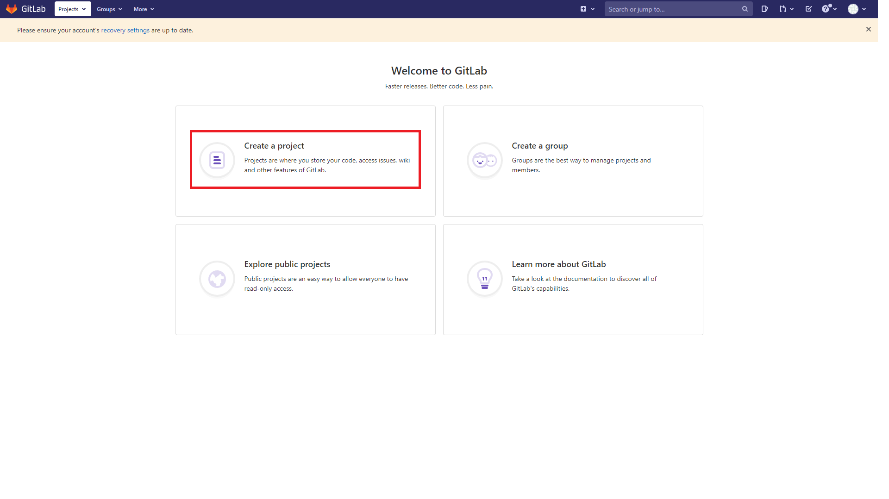
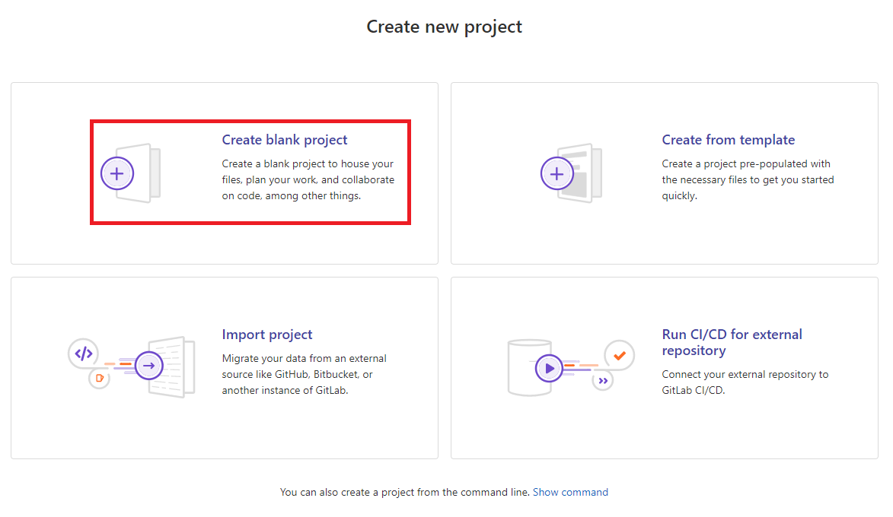
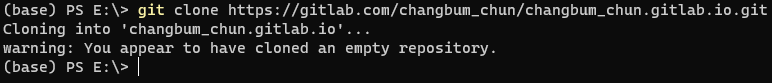
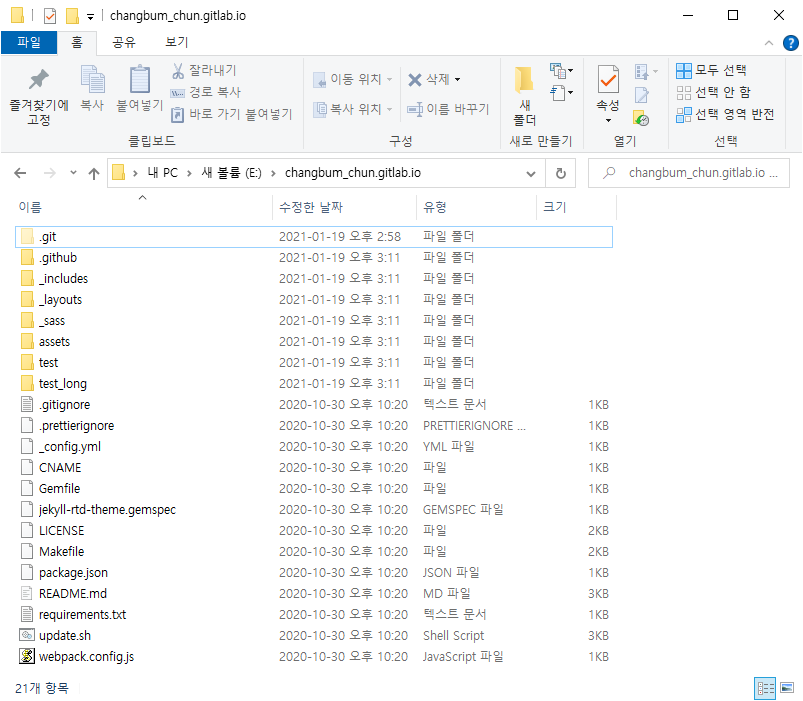
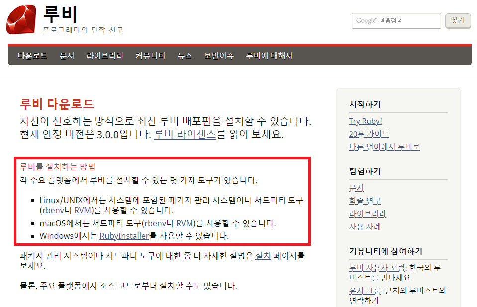
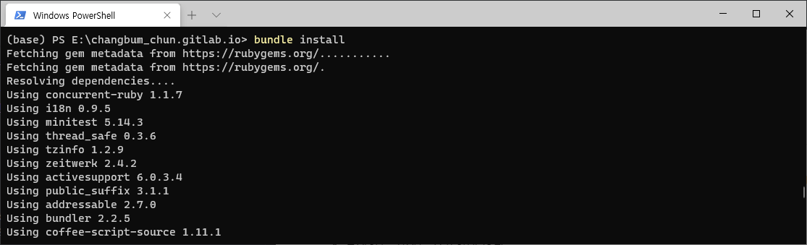
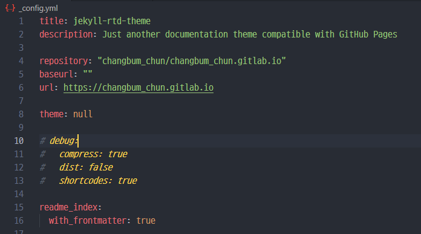
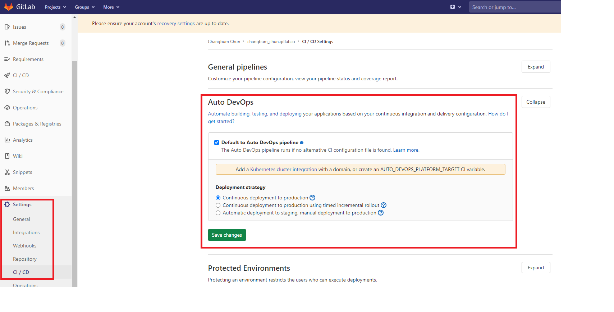
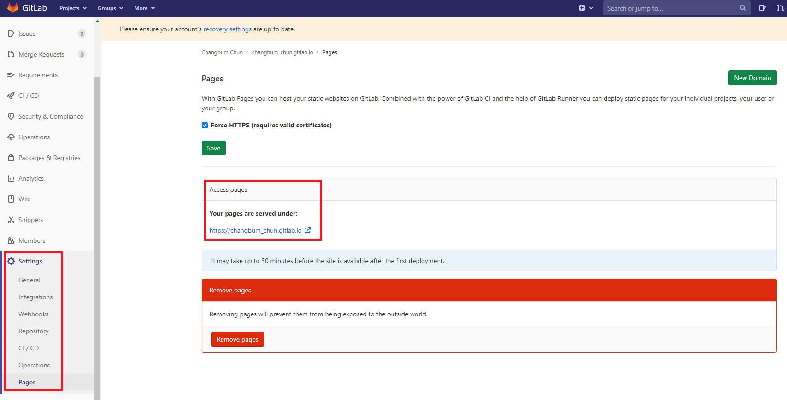

# Gitlab Page Tutorial 😎
_*본 문서는 Windows10 환경 기반으로 작성 되었습니다._

_**에디터는 VSCode가 사용 되었습니다._

## 0. 목차
1. GitLab 프로젝트 생성
1. Jekyll template 적용
1. Ruby 환경 설정
1. GitLab 호스팅 설정
1. Template 수정


## 1. GitLab 프로젝트 생성
### 새로운 프로젝트 만들기
- 웹페이지를 호스팅 해줄 GitLab으로 넘어와서 Remote repository를 생성한다.





- 로그인 후 새 프로젝트를 생성한다.
    - Create a project -> Create blank project

### 프로젝트 환경 설정

- Project name의 형식은 "userName.gitlab.io"으로 작성한다.
    - 위반 시 URL이 지저분 해진다.
- Visibility Level은 Public으로 설정한다.
    - Repository에 대한 권한이기 때문에 사실 상관 없음

### 로컬 환경에 Clone
- 생성한 Remote repository를 로컬의 원하는 디렉토리에 클론한다.

```git
$ cd "디렉토리"
$ git clone "Repository"
```

## 2. Jekyll 템플렛 적용
- 이 튜토리얼에선 [Jekyll](http://jekyllrb-ko.github.io)이란 정적 사이트 생성기를 사용하여 웹페이지를 제작한다.
- 이미 세상엔 Jekyll로 만들어진 멋진 템플렛들이 많고 [Jekyll Themes](http://jekyllthemes.org/)에서 둘러볼 수 있다.
### 템플렛 선택


- 우리는 이 예제에서 [jekyll-rtd-theme](http://jekyllthemes.org/themes/jekyll-rtd-theme/)을 사용한다.
    - 해당 테마는 [sphinx](https://www.sphinx-doc.org/en/master/)로부터 영감 받아 탄생했다.

### 템플렛 받아오기
- 원하는 템플렛을 받아오는 방법은 두가지가 있다.
    - 직접 [다운](https://github.com/rundocs/jekyll-rtd-theme/zipball/master) 받는 방법과
    - 템플렛의 repository를 로컬로 [clone](https://github.com/rundocs/jekyll-rtd-theme)하는 방법


- 💡중요한 것은 __템플렛의 내용물을__ 위에서 우리가 생성하고 clone한 __GitLab의 로컬 repository에 위치 시키는 것__ 이다.

## 3. Ruby 환경 설정 💎
- Jekyll은 [Ruby](https://www.ruby-lang.org/ko/) 언어로 작성 되었다.

### Ruby 다운로드


- [Ruby 다운로드 링크](https://www.ruby-lang.org/ko/downloads/)에서 파일을 받아 설치해야 한다.
    - 설치하는 위치는 중요하지 않다.
    - 설치 중 복잡한 세부 사항은, 늘 그렇듯, 다음을 눌러 완료한다.

- Ruby 설치를 완료 했다면 콘솔창에서 아래 명령어로 작동 및 버전을 확인한다.

```console
# Ruby 설치/버전 확인
$ ruby -v
```
### Jekyll 설치

- Ruby가 제대로 작동한다면 아래와 같이 콘솔창에서 gem을 사용해 jekyll bundler와 bundle을 설치한다.

```console
$ gem install jekyll bundler
$ bundle install
```

TODO: 확실하진 않지만, gitlab은 CI를 .yml파일을 통해 설정해줘야 하고, 이 절차 때문에 ruby설치가 불필요 할 수도 있다.



## 4. GitLab 호스팅 설정
- 내가 원하는대로 커스터마이즈 전에, 우선, 적용한 템플릿의 기본 상태를 확인 해보자.
- 위에서 받은 jekyll 템플릿 덕에 대부분의 설정은 완료 되어 있다.
- 하지만 수정해야할 파일이 하나 있다.


- _config.yml 파일에서 repository, baseurl, url 세가지를 추가한다.

```yml
repository: "userId/userId.gitlab.io"
baseurl: ""
url: https://userId.gitlab.io
```

### CI 설정하기
- 우리가 로컬에서 push하여 repository를 업데이트하면 똑똑한 GitLab은 CI pipeline을 통해 스스로 변경 사항을 새로 호스팅한다.
- 이를 `Auto DevOps`라 하는데 설정이 되어 있지 않은 경우 아래 그림 처럼 __Default to Auto DevOps pipeline의 체크박스를 체크__ 해야 한다.



### Page 확인하기
- 위의 순서를 잘 진행 했다면 Local repository의 변경 사항을 add, commit, push 하면 된다.


- 이후 GitLab CI의 pipeline에서 작업이 끝나길 기다린 후(약 3분) Setting의 Pages url를 클릭하면 우리가 만든 웹페이지로 새 창 이동한다.
    - 사이드 바의 CI/CD 탭에서 pipeline 진행 상황을 관찰할 수 있다.

## 5. Template 수정
오늘은 여기까지